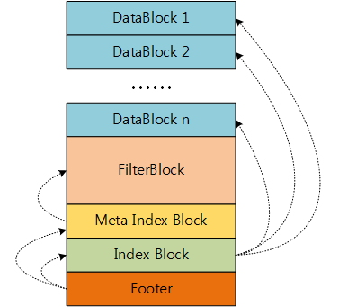

# SSTable逻辑结构

SSTable逻辑结构由`TableBuilder`创建，如下图所示：

- `DataBlock`存储KV数据，以及整个数据块的压缩类型`CompressionType`(uint8)和`crc`(uint32).
- `FilterBlock`中的各个filter结构分别对应于各个`DataBlock`中的key. 在生成每一个`DataBlock`时也生成相应的filter结构，只有把所有的`DataBlock`写入SSTable文件后，才把这些filter结构组织成`FilterBlock`并写入SSTable文件.
- `Meta Index Block`同`DataBlock`一样，也是由`BlockBuilder`构建的KV存储结构，只不过key是构建`FilterBlock`的过滤器的名字，形如`filter.Name`，value是`FilterBlock`的大小及其在SSTable文件中偏移地址. `Meta Index Block`用以索引`FilterBlock`.
- `Index Block`同样是由`BlockBuilder`构建，对于其中的每一条KV数据：`DataBlock i`的最后一个key <= `key i` < `DataBlock i+1`的第1个key, `value i` = `DataBlock i`的大小及其在SSTable文件中的偏移地址. `Index Block`用以索引各个`DataBlock`.
- `Footer`中的信息包括: `Meta Index Block`和`Index Block`的大小及其在sstable文件中的偏移地址; 64-bit的MagicNumber. 通过`Footer`的索引信息可以访问其他所有数据结构.