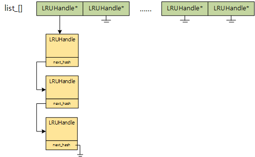
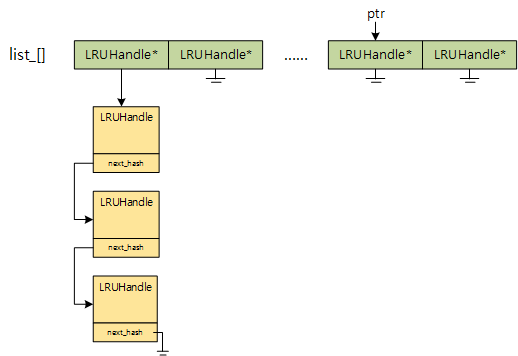
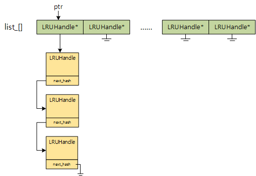
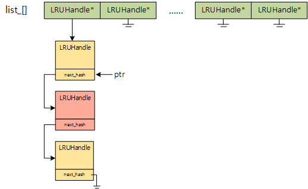
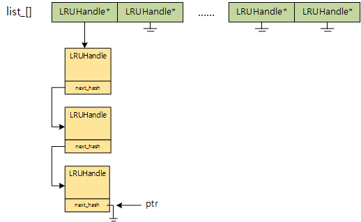
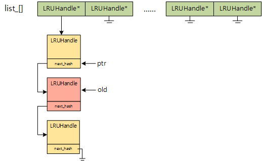
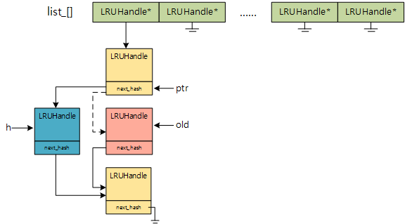
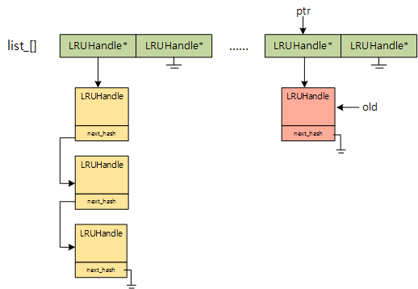
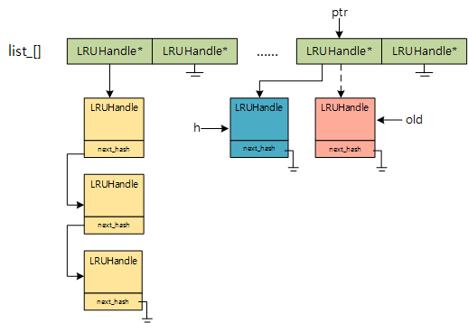

# LevelDB的LRU Cache实现分析
## 一、`HandleTable`
`HandleTable`是保存`LRUHandle`的哈希表.
### 1. `HandleTable::FindPointer`


**图1.1-哈希表HandleTable的组织方式**

`list_[]`是哈希表的主体，使用分离链接法处理冲突. `HandleTable::FindPointer`函数在哈希表中查找指定的`key`, 代码如下：

```cpp
LRUHandle** FindPointer(const Slice& key, uint32_t hash) {
    LRUHandle** ptr = &list_[hash & (length_ - 1)];
    while (*ptr != nullptr && ((*ptr)->hash != hash || key != (*ptr)->key())) {
      ptr = &(*ptr)->next_hash;
    }
    return ptr;
}
```

首先将`ptr`定位到`list_[]`的某一个槽位, 如果出现如下情况:



**图1.2**

由于`*ptr==nullptr`所以直接退出循环, 返回`ptr`.

如果是下面这种情况:



**图1.3**

在循环过程中遍历链表上的`LRUHandle`对象是通过`next_hash`指针进行的, 如果找到匹配的`key`（假设是第2个`LRUHandle`对象）, 那么`ptr`的情形如下:



**图1.4**

`ptr`是`LRUHandle**`类型，`next_hash`是`LRUHandle*`类型，`*ptr`指向的就是与`key`匹配的`LRUHandle`对象.

如果在链表中没有找到匹配的`key`，那么退出循环后`ptr`的情形如下:



**图1.5**

`*ptr`等价于链表中最后一个`LRUHandle`对象的`next_hash`指针.

综上，如果能在哈希表中找到匹配的`key`，那么`*ptr`就指向相应的`LRUHandle`对象；否则`*ptr`为`nullptr`，并且如果要添加新的`LRUHandle`对象，只需修改`ptr`指向的`LRUHandle*`指针，将新的对象链入，详见`HandleTable::Insert`的分析.

### 2. `HandleTable::Insert`

```cpp
LRUHandle* Insert(LRUHandle* h) {
   LRUHandle** ptr = FindPointer(h->key(), h->hash);
   LRUHandle* old = *ptr;
   h->next_hash = (old == nullptr ? nullptr : old->next_hash);
   *ptr = h;
   if (old == nullptr) {
     ++elems_;
     if (elems_ > length_) {
       // Since each cache entry is fairly large, we aim for a small
       // average linked list length (<= 1).
       Resize();
     }
   }
   return old;
}
```

首先通过`FindPointer`找到插入位置`ptr`. 如果查找失败，即哈希表中没有`h`这个节点，那么`old`就为`nullptr`，随后修改`ptr`指向的`LRUHandle*`指针将`h`链入，对应于**图1.2**和**图1.5**两种情况. 如果查找成功，则`ptr`和`old`的情形如下图所示:



通过修改指针将`h`链入后的情形如下:



`old`指向的对象已被从链表中移除了，也就不再属于哈希表，所以对于重复元素的插入策略是：**用新的替换旧的**. 在`LRUCache::Insert`函数中通过调用`LRUCache::FinishErase`对`old`指向的`LRUHandle`对象做进一步处理.

注意，在查找成功的情况下还可能出现如下情形:



根据“**用新的替换旧的**”的插入策略，将`h`链入后的情形如下:



### 3. `HandleTable::Remove`

```cpp
LRUHandle* Remove(const Slice& key, uint32_t hash) {
   LRUHandle** ptr = FindPointer(key, hash);
   LRUHandle* result = *ptr;
   if (result != nullptr) {
     *ptr = result->next_hash;
     --elems_;
   }
   return result;
}
```

从哈希表中删除`LRUHandle`对象，简单明了，不做解释.

## 二、整个LRU Cache的组织形式
`SharedLRUCache`对象是一个总的大Cache，这个大Cache内部被分为`kNumShards`份小Cache，每一份小Cache都是一个`LRUCache`对象，而每一个`LRUCache`对象又是由若干个`LRUHandle`对象构成（`LRUCache`将这些`LRUHandle`用双向循环链表组织起来，并用哈希表保存这些`LRUHandle`的指针，以便快速查找），当这些`LRUHandle`对象的总容量超过`LRUCache`的最大容量时，就会按照LRU算法将某些`LRUHandle`从`LRUCache`中移除.